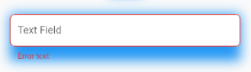
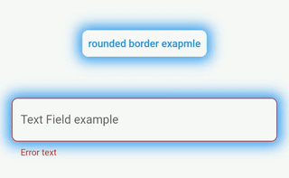
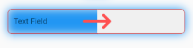
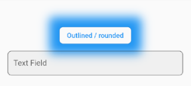

Applies additional appearance settings to Flutter text fields and buttons. Currently supports: outer shadow, inner shadow, border, inner gradient.

Try it out: [example](https://astoniocom.github.io/control_style/)

## Intro

The Flutter library provides limited opportunities to set up the appearance of buttons and text fields. You usually make this customisation by wrapping the components into a `Container` widget and configuring it using the `decoration` parameter. Such an approach has limitations as it leads to increasing the volume of work and complicating the code. Especially time consuming in this case is creating animations for switching between different appearances depending on a state of a control.

In addition, this approach works incorrectly when you are adding shadows to text fields in combination with `errorText` and `helperText`:




This package helps to solve the aforementioned problem. It provides the most common customisation features for control elements.

The package provides the same customisation parameters to all text fields and buttons, which allows for identically decorating any of the controls.

## Features



The package enables outer shadow, inner shadow, border and inner gradient styles for Flutter’s standard buttons and text fields. These can be applied without using external button or text field widgets.

## Usage

You can customize all your controls at once via the `theme` setting of `MaterialApp`, or separate controls through changing their own styles.

To use the plugin with inputs, you need to wrap `InputBorder` with `DecoratedInputBorder` and configure its parameters.

For example, the code:

``` dart
    MaterialApp(
      theme: ThemeData(
        inputDecorationTheme: InputDecorationTheme(
          border: OutlineInputBorder(
            borderRadius: BorderRadius.circular(8),
          ),
        ),
      ),
    );
```

should be updated to:

``` dart
    MaterialApp(
      theme: ThemeData(
        inputDecorationTheme: InputDecorationTheme(
          border: DecoratedInputBorder(
            shadow: const [
              BoxShadow(
                color: Colors.blue,
                blurRadius: 12,
              )
            ],
            child: OutlineInputBorder(
              borderRadius: BorderRadius.circular(8),
            ),
          ),
        ),
      ),
    );
```

For buttons, you need to wrap `OutlinedBorder` with `DecoratedOutlinedBorder` and configure its parameters.

Hence, this code:

``` dart
    MaterialApp(
      theme: ThemeData(
        primarySwatch: Colors.blue,
        outlinedButtonTheme: OutlinedButtonThemeData(
            style: ElevatedButton.styleFrom(
          shape: RoundedRectangleBorder(
            borderRadius: BorderRadius.circular(8),
          ),
        )),
      ),
    );
```

should be updated to:

``` dart
    MaterialApp(
      theme: ThemeData(
        primarySwatch: Colors.blue,
        outlinedButtonTheme: OutlinedButtonThemeData(
            style: ElevatedButton.styleFrom(
          shape: DecoratedOutlinedBorder(
            shadow: const [
              BoxShadow(
                color: Colors.blue,
                blurRadius: 12,
              )
            ],
            child: RoundedRectangleBorder(
              borderRadius: BorderRadius.circular(8),
            ),
          ),
        )),
      ),
    );
```

The examples above show how to decorate all the controls at once. 

In case you need to decorate separate element, you need to configure its styles:

``` dart
    TextField(
      decoration: InputDecoration(
          border: DecoratedInputBorder(
        shadow: const [
          BoxShadow(
            color: Colors.blue,
            blurRadius: 12,
          )
        ],
        child: OutlineInputBorder(
          borderRadius: BorderRadius.circular(8),
        ),

      )),
    );

    ...

    ElevatedButton(
      onPressed: () {},
      child: const Text("Button"),
      style: ElevatedButton.styleFrom(
          shape: DecoratedOutlinedBorder(
        shadow: const [
          BoxShadow(
            color: Colors.blue,
            blurRadius: 12,
          )
        ],
        child: RoundedRectangleBorder(
          borderRadius: BorderRadius.circular(8),
        ),
      )),
    );
```

### Animation

To configure element state change animations, use the usual Flutter’s approach.

``` dart
TextButton(
  onPressed: () {},
  child: const Text("Text button"),
  style: ButtonStyle(
    shape: MaterialStateProperty.resolveWith((states) {
      return DecoratedOutlinedBorder(
        shadow: [
          GradientShadow(
            gradient: states.contains(MaterialState.pressed)
                ? const LinearGradient(colors: [Colors.red, Colors.green, Colors.cyan])
                : const LinearGradient(colors: [Colors.blue, Colors.blue]),
            blurRadius: 12,
          )
        ],
        child: RoundedRectangleBorder(borderRadius: BorderRadius.circular(8)),
      );
    }),
  ),
)
````


### Outer shadow

Add the `shadow` parameter to `DecoratedInputBorder` or `DecoratedOutlinedBorder`. 

For adding a single-colour shadow, use `BoxShadow`.

``` dart
TextButton(
  onPressed: () {},
  child: const Text("Text button"),
  style: TextButton.styleFrom(
      shape: DecoratedOutlinedBorder(
    shadow: const [
      BoxShadow(
        color: Colors.blue,
        blurRadius: 12,
      )
    ],
    child: RoundedRectangleBorder(borderRadius: BorderRadius.circular(8)),
  )),
);
```


For applying a gradient-shadow, use `GradientShadow`. It is different from `BoxShadow` only in that instead of `color` it uses the `gradient` parameter.

``` dart
TextButton(
  onPressed: () {},
  child: const Text("Text button"),
  style: TextButton.styleFrom(
      shape: DecoratedOutlinedBorder(
    shadow: const [
      GradientShadow(
        gradient: LinearGradient(colors: [Colors.red, Colors.green, Colors.cyan]),
        blurRadius: 12,
      )
    ],
    child: RoundedRectangleBorder(borderRadius: BorderRadius.circular(8)),
  )),
)
```


### Inner shadow

Add `innerShadow` for `DecoratedInputBorder` or `DecoratedOutlinedBorder`.

For adding a single-colour shadow, use `BoxShadow`.

``` dart
TextButton(
  onPressed: () {},
  child: const Text("Text button"),
  style: TextButton.styleFrom(
      shape: DecoratedOutlinedBorder(
    innerShadow: const [
      BoxShadow(
        color: Colors.blue,
        blurRadius: 12,
      )
    ],
    child: RoundedRectangleBorder(borderRadius: BorderRadius.circular(8)),
  )),
)
```


For applying a gradient-shadow, use `GradientShadow`. It is different from `BoxShadow` only in that instead of `color` it uses the `gradient` parameter.

``` dart
TextButton(
  onPressed: () {},
  child: const Text("Text button"),
  style: TextButton.styleFrom(
      shape: DecoratedOutlinedBorder(
    innerShadow: const [
      GradientShadow(
        gradient: LinearGradient(colors: [Colors.red, Colors.green, Colors.cyan]),
        blurRadius: 12,
      )
    ],
    child: RoundedRectangleBorder(borderRadius: BorderRadius.circular(8)),
  )),
)
```


### Background

Add the `backgroundGradient` parameter of the `Gradient` type to `DecoratedInputBorder` or `DecoratedOutlinedBorder`.

``` dart
TextButton(
  onPressed: () {},
  child: const Text("Text button"),
  style: ButtonStyle(
    shape: MaterialStateProperty.resolveWith((states) {
      return DecoratedOutlinedBorder(
        backgroundGradient: LinearGradient(colors: [Colors.blue.withOpacity(0.5), Colors.blue.withOpacity(0.2)]),
        child: RoundedRectangleBorder(borderRadius: BorderRadius.circular(8)),
      );
    }),
  ),
)
```


### Border

Add the `borderGradient` or `GradientBorderSide` parameter to `DecoratedInputBorder` or `DecoratedOutlinedBorder`. This parameters differ from the Flutter’ `BorderSide` in that they use `gradient` parameter instead of `color`.

``` dart
TextButton(
  onPressed: () {},
  child: const Text("Text button"),
  style: ButtonStyle(
    shape: MaterialStateProperty.resolveWith((states) {
      return DecoratedOutlinedBorder(
        borderGradient: const GradientBorderSide(
          gradient: LinearGradient(colors: [Colors.red, Colors.green, Colors.blue]),
          width: 3,
        ),
        child: RoundedRectangleBorder(borderRadius: BorderRadius.circular(8)),
      );
    }),
  ),
)
```


## BorderShadow in Detail

The wrappers `DecoratedInputBorder` and `DecoratedOutlinedBorder` reach an element’s border through the `child` parameter and apply stylization above the default border of this element. In case of an outer shadow, the shadow’s part above the control then gets cut off in order to create an illusion of the shadow being located behind the control.



Decorative styles are applied above the layer that contains an element’s border. Hence, when it comes to buttons, such stylisation overlaps the inner area of an element. Using transparent colours hence used to address this issue. This limitation is due to Flutter itself.


## Compatibility

The following borders have been tested.

Inputs:
- UnderlineInputBorder
- OutlineInputBorder

Buttons:
- BeveledRectangleBorder
- CircleBorder
- ContinuousRectangleBorder
- RoundedRectangleBorder
- StadiumBorder

## Issues

- Shadows may overlap nearby elements.



- The decoration of the inner area of the button overlaps the button itself.


