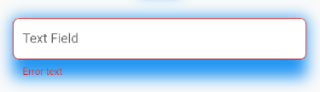
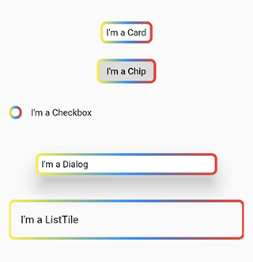
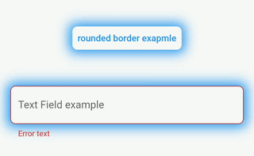
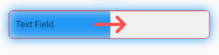
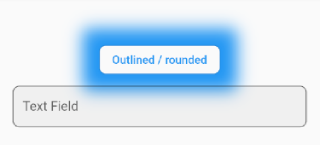

Applies additional appearance settings to Flutter text fields, buttons and other controls. Currently supports: outer shadow, inner shadow, border, inner gradient.

Try it out: [example](https://astoniocom.github.io/control_style/)

## Intro

The Flutter library provides limited opportunities to set up the appearance of controls. You usually make this customisation by wrapping the components into a `Container` widget and configuring it using the `decoration` parameter. Such an approach has limitations as it leads to increasing the volume of work and complicating the code. Especially time consuming in this case is creating animations for switching between different appearances depending on a state of a control.

In addition, this approach works incorrectly when you are adding shadows to text fields in combination with `errorText` and `helperText`:




This package helps to solve the aforementioned problem. It provides the most common customisation features for control elements which have a `shape` field such as buttons, text fields, `Card`, `Chip`, `Checkbox`, `Dialog`, `Drawer`, inks, `ListTile`, `Material`, `NavigationBar`.

The package provides the same customisation parameters to all controls, which allows for identically decorating any of the controls.

``` dart
final outlinedShape = DecoratedOutlinedBorder(
  borderGradient: const GradientBorderSide(
    gradient: LinearGradient(colors: [Colors.yellow, Colors.blue, Colors.red]),
    width: 2,
  ),
  child: RoundedRectangleBorder(borderRadius: BorderRadius.circular(8)),
);

...
  Column(children: [
    const SizedBox(height: 16),
    Card(child: const Padding(padding: EdgeInsets.all(8.0), child: Text("I'm a Card")), shape: outlinedShape),
    const SizedBox(height: 16),
    Chip(label: const Text("I'm a Chip"), shape: outlinedShape),
    const SizedBox(height: 16),
    Row(children: [Checkbox(value: false, onChanged: (value) {}, shape: outlinedShape), const Text("I'm a Checkbox")]),
    const SizedBox(height: 16),
    Dialog(child: const Padding(padding: EdgeInsets.all(8.0), child: Text("I'm a Dialog")), shape: outlinedShape),
    const SizedBox(height: 16),
    ListTile(title: const Text("I'm a ListTile"), shape: outlinedShape),
    const SizedBox(height: 16),
  ]);
...

```



## Features



The package enables outer shadow, inner shadow, border and inner gradient styles for Flutter’s standard controls. These can be applied without using external control widgets.

## Usage

You can customize all your controls at once via the `theme` setting of `MaterialApp`, or separate controls through changing their own styles.

To use the plugin with inputs, you need to wrap `InputBorder` with `DecoratedInputBorder` and configure its parameters.

For example, the code:

``` dart
    MaterialApp(
      theme: ThemeData(
        inputDecorationTheme: InputDecorationTheme(
          border: OutlineInputBorder(
            borderRadius: BorderRadius.circular(8),
          ),
        ),
      ),
    );
```

should be updated to:

``` dart
    MaterialApp(
      theme: ThemeData(
        inputDecorationTheme: InputDecorationTheme(
          border: DecoratedInputBorder(
            shadow: const [
              BoxShadow(
                color: Colors.blue,
                blurRadius: 12,
              )
            ],
            child: OutlineInputBorder(
              borderRadius: BorderRadius.circular(8),
            ),
          ),
        ),
      ),
    );
```

For buttons, you need to wrap `OutlinedBorder` with `DecoratedOutlinedBorder` and configure its parameters.

Hence, this code:

``` dart
    MaterialApp(
      theme: ThemeData(
        outlinedButtonTheme: OutlinedButtonThemeData(
            style: OutlinedButton.styleFrom(
          shape: RoundedRectangleBorder(
            borderRadius: BorderRadius.circular(8),
          ),
        )),
      ),
    );
```

should be updated to:

``` dart
    MaterialApp(
      theme: ThemeData(
        outlinedButtonTheme: OutlinedButtonThemeData(
            style: OutlinedButton.styleFrom(
          shape: DecoratedOutlinedBorder(
            shadow: const [
              BoxShadow(
                color: Colors.blue,
                blurRadius: 12,
              )
            ],
            child: RoundedRectangleBorder(
              borderRadius: BorderRadius.circular(8),
            ),
          ),
        )),
      ),
    );
```

The examples above show how to decorate all the controls at once. 

In case you need to decorate a separate element, you need to configure its styles:

``` dart
    TextField(
      decoration: InputDecoration(
          border: DecoratedInputBorder(
        shadow: const [
          BoxShadow(
            color: Colors.blue,
            blurRadius: 12,
          )
        ],
        child: OutlineInputBorder(
          borderRadius: BorderRadius.circular(8),
        ),

      )),
    );

    ...

    ElevatedButton(
      onPressed: () {},
      child: const Text("Button"),
      style: ElevatedButton.styleFrom(
          shape: DecoratedOutlinedBorder(
        shadow: const [
          BoxShadow(
            color: Colors.blue,
            blurRadius: 12,
          )
        ],
        child: RoundedRectangleBorder(
          borderRadius: BorderRadius.circular(8),
        ),
      )),
    );
```

### Animation

To configure element state change animations, use the usual Flutter’s approach.

``` dart
TextButton(
  onPressed: () {},
  child: const Text("Text button"),
  style: ButtonStyle(
    shape: WidgetStateProperty.resolveWith((states) {
      return DecoratedOutlinedBorder(
        shadow: [
          GradientShadow(
            gradient: states.contains(WidgetState.pressed)
                ? const LinearGradient(colors: [Colors.red, Colors.green, Colors.cyan])
                : const LinearGradient(colors: [Colors.blue, Colors.blue]),
            blurRadius: 12,
          )
        ],
        child: RoundedRectangleBorder(borderRadius: BorderRadius.circular(8)),
      );
    }),
  ),
)
```


### Outer shadow

Add the `shadow` parameter to `DecoratedInputBorder` or `DecoratedOutlinedBorder`. 

For adding a single-colour shadow, use `BoxShadow`.

``` dart
TextButton(
  onPressed: () {},
  child: const Text("Text button"),
  style: TextButton.styleFrom(
      shape: DecoratedOutlinedBorder(
    shadow: const [
      BoxShadow(
        color: Colors.blue,
        blurRadius: 12,
      )
    ],
    child: RoundedRectangleBorder(borderRadius: BorderRadius.circular(8)),
  )),
);
```


For applying a gradient-shadow, use `GradientShadow`. It is different from `BoxShadow` only in that instead of `color` it uses the `gradient` parameter.

``` dart
TextButton(
  onPressed: () {},
  child: const Text("Text button"),
  style: TextButton.styleFrom(
      shape: DecoratedOutlinedBorder(
    shadow: const [
      GradientShadow(
        gradient: LinearGradient(colors: [Colors.red, Colors.green, Colors.cyan]),
        blurRadius: 12,
      )
    ],
    child: RoundedRectangleBorder(borderRadius: BorderRadius.circular(8)),
  )),
)
```


### Inner shadow

Add `innerShadow` for `DecoratedInputBorder` or `DecoratedOutlinedBorder`.

For adding a single-colour shadow, use `BoxShadow`.

``` dart
TextButton(
  onPressed: () {},
  child: const Text("Text button"),
  style: TextButton.styleFrom(
      shape: DecoratedOutlinedBorder(
    innerShadow: const [
      BoxShadow(
        color: Colors.blue,
        blurRadius: 12,
      )
    ],
    child: RoundedRectangleBorder(borderRadius: BorderRadius.circular(8)),
  )),
)
```


For applying a gradient-shadow, use `GradientShadow`. It is different from `BoxShadow` only in that instead of `color` it uses the `gradient` parameter.

``` dart
TextButton(
  onPressed: () {},
  child: const Text("Text button"),
  style: TextButton.styleFrom(
      shape: DecoratedOutlinedBorder(
    innerShadow: const [
      GradientShadow(
        gradient: LinearGradient(colors: [Colors.red, Colors.green, Colors.cyan]),
        blurRadius: 12,
      )
    ],
    child: RoundedRectangleBorder(borderRadius: BorderRadius.circular(8)),
  )),
)
```


### Background

Add the `backgroundGradient` parameter of the `Gradient` type to `DecoratedInputBorder` or `DecoratedOutlinedBorder`.

``` dart
TextButton(
  onPressed: () {},
  child: const Text("Text button"),
  style: ButtonStyle(
    shape: WidgetStateProperty.resolveWith((states) {
      return DecoratedOutlinedBorder(
        backgroundGradient: LinearGradient(colors: [Colors.blue.withValues(alpha: 0.5), Colors.blue.withValues(alpha: 0.2)]),
        child: RoundedRectangleBorder(borderRadius: BorderRadius.circular(8)),
      );
    }),
  ),
)
```


### Border

Add the `borderGradient` parameter of the `GradientBorderSide` type to `DecoratedInputBorder` or `DecoratedOutlinedBorder`. `GradientBorderSide` differs from Flutter’s `BorderSide` in that it uses the `gradient` parameter instead of `color`.

When `borderGradient` is set, it replaces the border of the wrapped `child`: the child’s own side becomes transparent and takes the width of the gradient side, so the child’s `color`, `width` and `strokeAlign` are ignored. To draw a single-colour border through the same mechanism, use a gradient of two identical colours.

The gradient side is painted inside the shape, exactly `width` logical pixels wide, like a `BorderSide` with `strokeAlign: BorderSide.strokeAlignInside`.

``` dart
TextButton(
  onPressed: () {},
  child: const Text("Text button"),
  style: ButtonStyle(
    shape: WidgetStateProperty.resolveWith((states) {
      return DecoratedOutlinedBorder(
        borderGradient: const GradientBorderSide(
          gradient: LinearGradient(colors: [Colors.red, Colors.green, Colors.blue]),
          width: 3,
        ),
        child: RoundedRectangleBorder(borderRadius: BorderRadius.circular(8)),
      );
    }),
  ),
)
```


## How It Works

The wrappers `DecoratedInputBorder` and `DecoratedOutlinedBorder` receive an element’s border through the `child` parameter and paint the decoration together with that border. In case of an outer shadow, the shadow’s part above the control is cut off in order to create an illusion of the shadow being located behind the control. This is controlled by the `clipInner` parameter (`true` by default); set it to `false` if you want the shadow to be painted over the interior as well.



Decorative styles are painted on the layer that contains an element’s border. Hence, when it comes to buttons, the background gradient and the inner shadow overlap the inner area of the element. Use transparent colours to work around this. This limitation is due to Flutter itself.


### Border side of buttons, checkboxes and chips

Buttons (`ButtonStyleButton`), `Checkbox` and `Chip` resolve their border side from their style or theme and apply it to the shape with `copyWith(side:)`, which overrides any `side` set on the wrapped `child`. For these controls set the side through the style, for example `OutlinedButton.styleFrom(side: ...)`, not on the `child` shape. This is Flutter behaviour and applies to plain `RoundedRectangleBorder` as well.

## Compatibility

The following borders have been tested.

Inputs:
- UnderlineInputBorder
- OutlineInputBorder

Buttons:
- BeveledRectangleBorder
- CircleBorder
- ContinuousRectangleBorder
- RoundedRectangleBorder
- StadiumBorder

## Migration

Upgrading from an older version? See [MIGRATION.md](MIGRATION.md).

## Issues

- Shadows may overlap nearby elements.



- The decoration of the inner area of the button overlaps the button itself.


